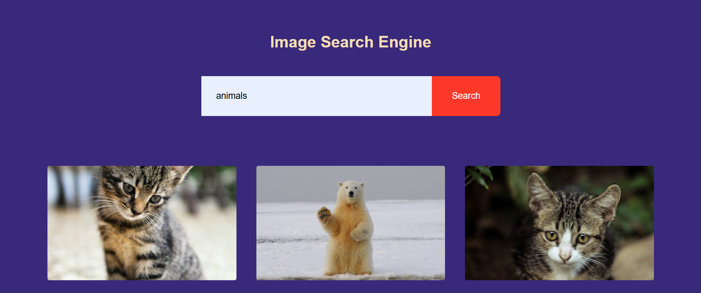
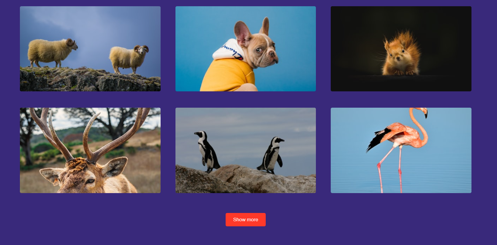

# 🖼️ Image Search Engine

A simple and responsive image search engine built with **HTML, CSS, and JavaScript**.  
The app fetches images from the **Unsplash API** based on user input and displays them in a clean grid layout with a "Show More" option for pagination.

---

## 🚀 Project Type
Frontend Project (HTML, CSS, JavaScript)

---

## ✨ Features
- Search any image by keyword using the Unsplash API
- Responsive grid-based image gallery
- “Show More” button to load additional images
- Click on an image to view it on Unsplash in a new tab

---

## 🛠️ Tech Stack
- **HTML5**
- **CSS3**
- **JavaScript (Fetch API)**
- **Unsplash API**

---

## 📂 Folder Structure
```
├── index.html # HTML file
├── style.css # Stylesheet
├── index.js # JavaScript logic (API fetch, rendering)
├── README.md # Project documentation
└── assets/ # Screenshots, demo images
```

## 📸 Demo
Here’s a preview of the project:  




---

## 🔗 Live Demo
[View Project](https://sk-sakirul.github.io/Image-Search-Engine/)

---

## 👨‍💻 Author
**Sakirul**  
[GitHub Profile](https://github.com/Sk-Sakirul)